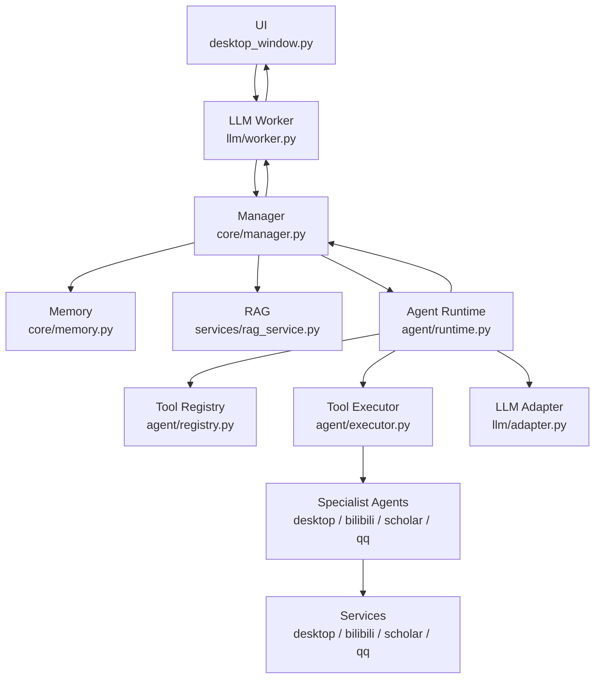

# Amadeus

一个用于学习 Agent、RAG、记忆、LLM 适配层和桌面交互的角色引擎项目。

## 部署

```bash
git clone <your-repo-url>
cd llmproject
python -m venv .venv
.\.venv\Scripts\activate
pip install -r requirements.txt
python main.py
```

运行前需要：

- 在 `config.py` 中配置可用模型
- 如果使用 DeepSeek，设置 `DEEPSEEK_API_KEY`
- 如果要使用 QQ 桌面能力，先登录 QQ

---

## 架构



```text
UI
└── Worker
    └── Manager
        ├── Memory
        ├── RAG
        └── Agent Runtime
            ├── Tool Registry
            ├── Tool Executor
            └── Specialist Agents
```

---

## 当前能力

### 对话与角色层

- 桌面聊天界面
- 基础情绪切换
- 模型适配层
- 对话记忆

### Agent 层

- 工具注册
- 工具发现
- 多步工具调用
- 专长 Agent 分层

### 已接入工具

| 领域 | 能力 |
| --- | --- |
| 基础 | 获取当前时间 |
| 桌面 | 打开网页、文件、桌面项目 |
| 学术 | 打开 Google Scholar、关键词搜索 |
| B 站 | 搜索视频并打开首个结果、打开收藏夹播放页 |
| QQ | 检查是否已打开、搜索联系人或群聊、经确认后发送短消息 |

---

## 预留改进点

| 模块 | 后续方向 |
| --- | --- |
| RAG | chunk、embedding、向量库、rerank |
| Memory | 长期记忆、结构化用户信息 |
| Agent | 流式 tool calling、风险确认、日志、重试、orphaned tool call 清理 |
| 桌面自动化 | 更稳定的 UI Automation、OCR 兜底、更完整的 QQ / 浏览器交互 |
| 扩展能力 | 插件系统、TTS、角色表现、事件协议 |
